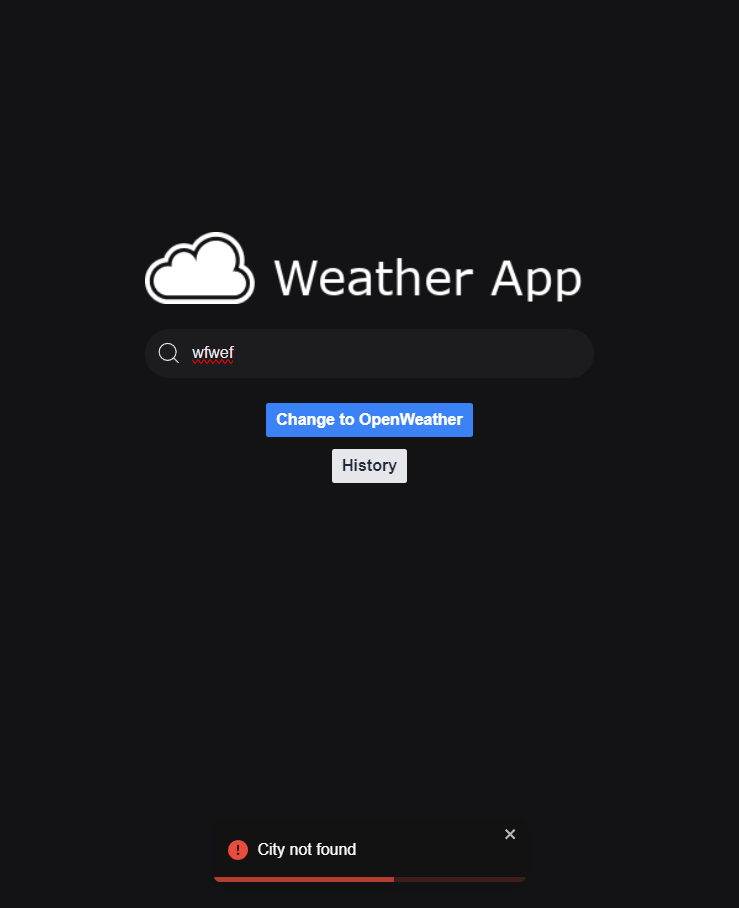
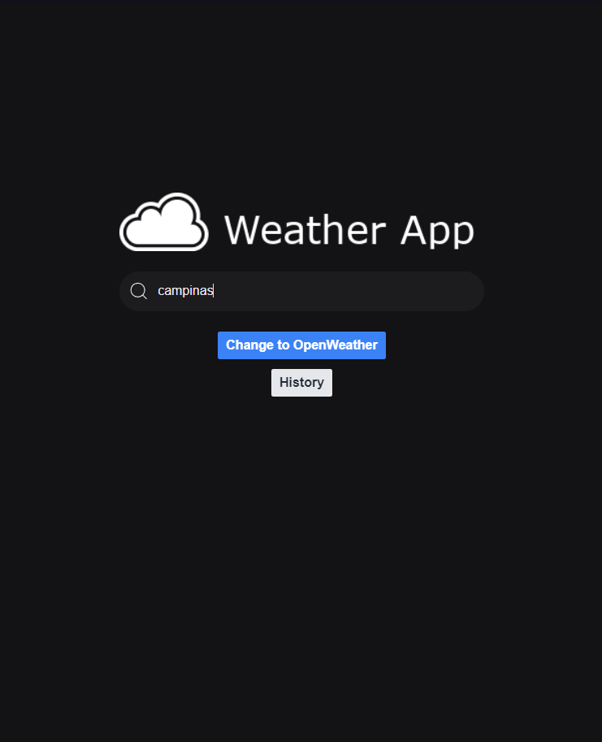
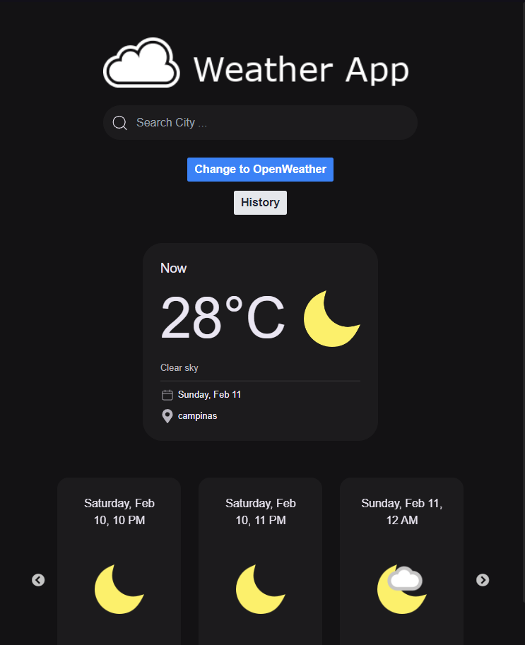
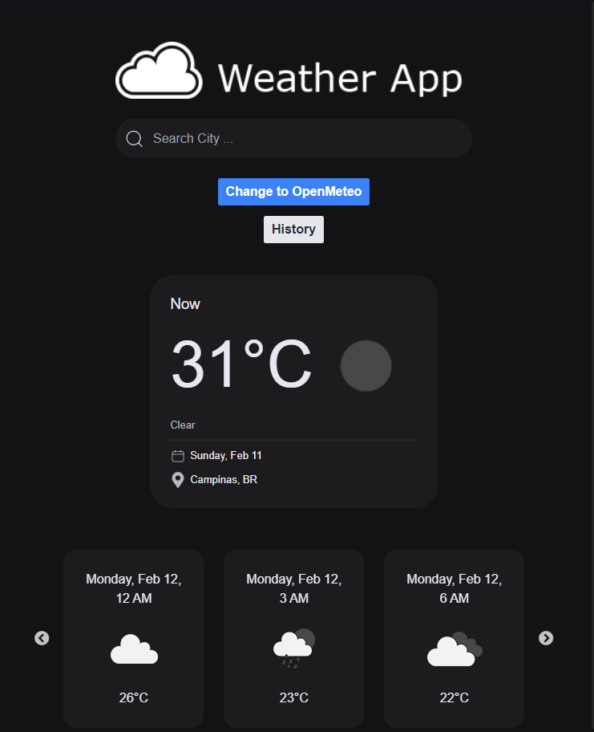
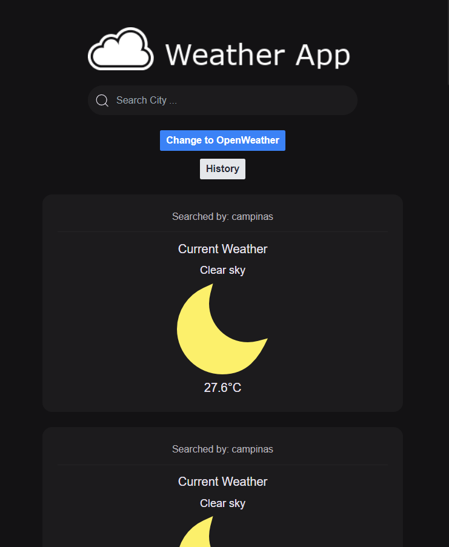
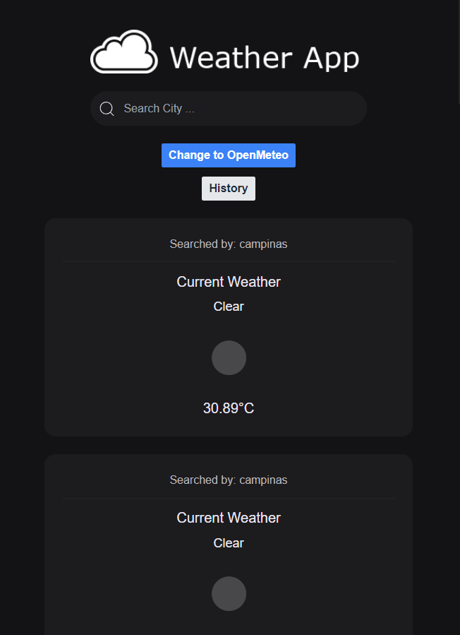

# Weather App

### Sobre

O WeatherQuery é uma aplicação web dinâmica projetada para oferecer aos usuários informações meteorológicas precisas e atualizadas com a flexibilidade de alternar entre duas renomadas fontes de dados: Open Weather Map e Open Meteo. Este projeto nasce da ideia de proporcionar uma experiência personalizada na busca por condições climáticas em qualquer cidade do mundo, permitindo aos usuários não apenas acessar informações em tempo real mas também comparar dados entre diferentes serviços de previsão do tempo.

**Características Principais:**

* **Flexibilidade na Escolha da Fonte de Dados:** Com um simples clique, você pode escolher entre a Open Weather Map e a Open Meteo para obter informações meteorológicas. Esta funcionalidade permite comparar previsões e escolher a fonte que você considera mais confiável ou informativa.
* **Histórico de Pesquisas:** Cada consulta é automaticamente armazenada no LocalStorage, permitindo um fácil acesso ao seu histórico de pesquisas. Esta característica torna simples revisitar as condições climáticas de locais consultados anteriormente, sem a necessidade de uma nova pesquisa.

**Tecnologias Utilizadas:**

* **ReactJS e Vite:** A base da aplicação é construída utilizando ReactJS no ambiente de desenvolvimento Vite, garantindo uma experiência de usuário fluida e responsiva, além de um desenvolvimento ágil.
* **TypeScript:** Empregado para adicionar tipagem estática ao projeto, o TypeScript melhora a manutenção do código e a detecção de erros, proporcionando um desenvolvimento mais seguro e eficiente.
* **Tailwind CSS:** Para estilização, utilizamos Tailwind CSS, uma framework CSS que permite criar designs personalizados com rapidez e eficiência, sem sacrificar a performance.
* **React Query e Zustand:** Para a gestão de estados e chamadas ao backend, o projeto faz uso da biblioteca React Query, otimizando a sincronização de estados e cache de dados. O Zustand, por sua vez, é utilizado para gerenciar o estado global da aplicação e o armazenamento de dados no LocalStorage, promovendo uma arquitetura limpa e eficiente.

### Como Executar

1. Se Cadastre no [site da OpenWeather](https://openweathermap.org) e obtenha uma API Key
2. Clone este Projeto
   ```bash
   git clone https://github.com/felipolis/weather-app.git
   ```
3. Adicione a API key nas variaveis de ambiente
   ```bash
   cp .env.example .env
   ```
4. Instale as dependencias
   ```bash
   yarn
   ```
5. Execute o projeto
   ```bash
   yarn dev
   ```

### Layouts






